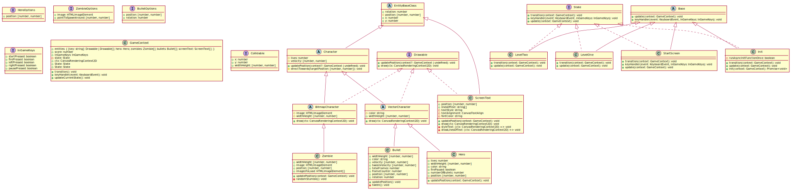

---
markdown:
  image_dir: /assets
  path: output.md
  absolute_image_path: false
---

# example heading

| f   | f   |
| --- | --- |
| f   | f   |

Text **bold**

## heading 2

{width=100%}

<!--  -->

```puml
Bob -> Alice: Hello!
```

```ts
let x: number = 11;

x = 12;
```

@import "src/app.ts"
